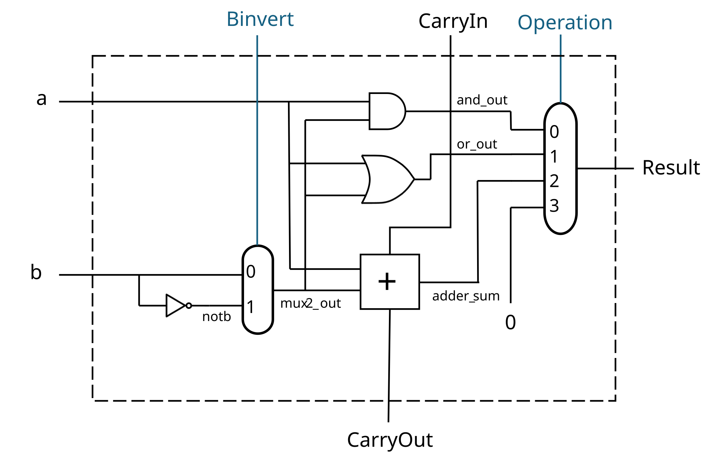

# One-bit ALU

**Deadline:** Friday, 3/6/2026

Write concise comments in code.

## Learning Objectives

* Implement combinational circuit in MyHDL.

* Implement combinational circuit from logic diagram.

### MyHDL

Please install MyHDL and run examples before the lab.

The MyHDL package installation instructions are [on this
page](https://github.com/zhijieshi/cse3666/tree/master/myhdl).

Examples of MyHDL are [in this
directory](https://github.com/zhijieshi/cse3666/tree/master/myhdl/examples).
Please study `gate2.py` and `mux.py` to learn how combinational circuit are
constructed in MyHDL. 

[The reference manual of MyHDL](http://docs.myhdl.org/en/stable/) explains the
data types for hardware design very well. It also also has many examples.

[This page](https://github.com/zhijieshi/cse3666/blob/master/myhdl/signals.md)
explains Signals and underlying data types we can use to store signals.

## Description

In this lab, we implement a 1-bit ALU in MyHDL. 

The circuit diagram of 1-bit ALU is shown below.  If the link does not work,
the file, `alu1.svg`, is in the same directory as this file.



Study the diagram. Note that all signals in the diagram are named. In later
labs, you may have to name signals yourself. Each signal must have a unique
name. Do **NOT** use the same name for different signals.  

Note that the output of the AND gate, the OR gate, and the adder (including
carryout) are always generated by hardware. They do not depend on the
operation signal.

### Skeleton code

The skeleton code is in `alu1.py`. The program does not run until we complete
all submodules/functions.

Study the skeleton code and read the comments in the code. 

**Important:** When we operate on single bits, it is recommended to use Python
logical operators `and`, `or`, and `not`. For multi-bit signals, we may use
bitwise logical operators `~`, `&`, `^`, and `|`. Since there is no logical
XOR, we also use `^` on single bits, if it is allowed. For example, we use the
following expressions to perform XOR operation on two bits `a` and `b` (both
are boolean).

    # if ^ is allowed
    a ^ b

    # if ^ is not allowed
    (a and not b) or (not a and b)

As you can see, we can use MyHDL Signals, like `a` and `b`, directly in an
expression. Python converts the Signal objects to its underlying datatypes
(bool, int, or intbv).

### Logical Expressions vs Hierarchal Blocks

We can build blocks using either logical expressions (e.g. the sum-of-products terms from a truth table) or by creating signals and instantiating instances of other blocks we have already defined. For instance, we can define a 2-1 mux in either way:

```python
@block
def Mux2_Logic(c, a, b, s):
    """ 2-1 Multiplexor.

    c -- mux output
    a, b -- data inputs
    s -- control input: select b if s is asserted, otherwise a

    Truth table:
        s a b c
        -------
        0 0 0 0 
        0 0 1 0
        0 1 0 1 c = ~s*a*~b
        0 1 1 1 c = ~s*a*b
        1 0 0 0
        1 0 1 1 c = s*~a*b
        1 1 0 0
        1 1 1 1 c = s*a*b

        Sum of products: 
            Write a sum of products that has four product terms.
            After simplifying it, we have the following: 

            c = (not s and a) or (s and b)
    """

    @always_comb
    def mux_logic():
        c.next = (not s and a) or (s and b)

    return mux_logic

@block
def Mux2_Gates(c, a, b, s):
    """ 2-1 Multiplexor.

    c -- mux output
    a, b -- data inputs
    s -- control input: select b if s is asserted, otherwise a


       s
       |
       *----------->|``-.  and1
       |            |    :------+    
    a -+----------->|..-`       |
       |                        +--->\``-.
       |                              |   :--> c
       |      nots              +--->/..-`
       +--|>o------>|``-.  and2 |
                    |    :------+  
    b ------------->|..-`

    """

     # Initialize internal signals
    nots = Signal(bool(0))
    and1 = Signal(bool(0))
    and2 = Signal(bool(0))

    # Instances of gates (variable names, e.g. "u_not", do not really matter)
    u_not = Not(nots, s)
    u_and1 = And2(and1, s, a)
    u_and2 = And2(and2, nots, b)
    u_or = Or2(c, and1, and2)

    # return all instances created above: u_not, u_and1, u_and2, and u_or
    return instances()

```

We will create a 1-bit adder using logic expressions and a 1-bit ALU using gates.

### Steps

Follow the steps to complete the function. Search `TODO` for the locations
where we need to add code. Budget 10 minutes for Steps 1, 2, 3, and 4, and 
10 to 15 minutes for Step 5.

1.  Complete `Or2()`. It is similar to `And2` function. 

2.  Complete `Mux2()`. Write a logical expression to generate the output.

    The expression is in the example shown earlier.

3.  Complete `Mux4()`. Write a logical expression. 

    You can find the expression in lecture slides.

4.  Generate `s` and `carryout` in `Adder1bit()`. `s` is the sum of the adder.
    Use logical expressions. 

    **Do not** use `+` in Python. We discussed in lecture how to build a full
    adder with basic gates. We can use Python operators `^`, `not`, `and`, and
    `or` in this step.

5.  Complete `ALU1bit()` by creating signals and instantiating every gate/block
    in the module. 

    The skeleton code has instantiated the NOT gate, which is `u_not`. The name
    of this particular gate, `u_not`, is not critical. You can call it `u1` if
    you like. Make sure you use a different name for each gate/block/module.

    The order of instantiation is not important. For example, you can
    instantiate the NOT gate first or the AND gate first.

### Testing

Note that we cannot run the code until we finish all steps. 

We can specify the operation(s) to be tested on the command line.  The default
operation is 2. The following command sets the `operation` signal to 0 (for the
AND operation). 

    python testalu1.py 0

The following command specifies operations 0, 1, and 2, and the expected output
is in `output.txt`. 

    python testalu1.py 0 1 2 

Pay attention to the `carryout` signals, which is always generated even if the
operation is not addition.

Please check the output of your program locally. It is faster to use file
comparison tools, for example, `diff` on Linux and `fc.exe` on Windows.
For example, the following commands help us check the output on Windows.

    python testalu1.py 0 1 2  > tmp.txt
    fc.exe tmp.txt output.txt

## Deliverables

Submit `alu1.py` and take the Lab5 quiz by the deadline.

## Simulation

Phoenix C., a former TA, also created the circuit in CircuitJS so students can
see how the ALU works through simulation. Follow steps below to run the
simulation.

*   Go to [Falstad's website](https://www.falstad.com/circuit/circuitjs.html)

*   Select "File/Import From Text..."

*   Copy the following code into the text box and click the OK button

*   You should see the circut in your web browser. Click 0 or 1 at the input
    to toggle the values. The green signals are 1. Click the "Run/STOP" button
    to start/pause the simulation.
 
```
$ 1 0.000005 10.20027730826997 50 5 43 5e-11
184 -144 144 32 144 0 1
196 48 112 192 112 2 1
L -80 240 -80 304 2 1 false 5 0
I -224 176 -144 176 0 0.5 5
L -224 176 -272 176 2 1 false 5 0
w -224 176 -224 144 0
w -224 144 -144 144 0
x -305 183 -292 186 4 24 b
x -117 333 -32 336 4 24 b_invert
w 48 144 -48 144 0
x 163 337 260 340 4 24 CarryOut
M 208 112 208 304 2 2.5
w 208 112 144 112 0
L 48 176 48 304 2 1 false 5 0
x 16 336 94 339 4 24 CarryIn
184 288 0 352 0 0 2
g 288 96 288 160 0 0
L 352 160 352 208 2 0 false 5 0
L 384 160 384 208 2 0 false 5 0
x 322 241 427 244 4 24 Operation
w 64 -32 192 -32 0
w 192 -32 192 0 0
w 192 0 288 0 0
w 64 32 288 32 0
L -208 -48 -272 -48 2 1 false 5 0
x -312 -42 -299 -39 4 24 a
150 -32 -32 64 -32 0 2 0 5
152 -32 32 64 32 0 2 5 5
w -32 -48 -208 -48 0
w -208 -48 -208 16 0
w -208 16 -32 16 0
w 48 112 -208 112 0
w -208 112 -208 16 0
w -48 144 -48 48 0
w -32 48 -48 48 0
w -48 48 -48 -16 0
w -48 -16 -32 -16 0
x 212 -11 298 -8 4 24 and_out
x 230 22 298 25 4 24 or_out
x 180 54 300 57 4 24 adder_sum
x -55 165 50 168 4 24 mux2_out
w 144 176 240 176 0
w 240 176 240 64 0
w 240 64 288 64 0
x 257 86 303 89 4 24 zero
M 416 0 480 0 2 2.5
x 507 6 565 9 4 24 result
```
